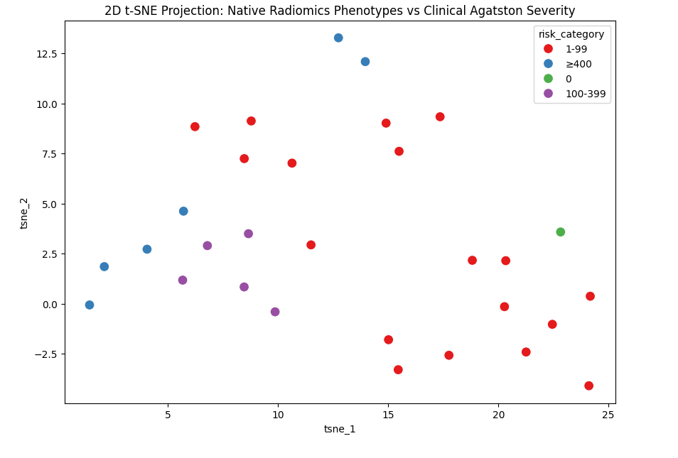

# OVERVIEW
This repository is used for my submission to PrediCT Projects on Google Summer of Code 2026

# INTRODUCTION
As a backend engineer, I am more familiar with backend technologies such as databases, APIs, and system architecture. However, I am also interested in machine learning and data science, and also medical topic which help treat disease. I believe that this project is a great opportunity to learn more about these topics.

# GUIDELINE
1. Insert all dataset inside `data_raw` directory
2. *IF USING LINUX* : I am using Linux Ubuntu which blocking to run `pip` directly on host machine. You could use this command to install `venv` (virtual environment) first to run pip on your linux/ubuntu machine if its blocked. 
    ```
    sudo apt update
    sudo apt install python3.12-venv
    ```
3. Then activate venv inside your project folder    
    ```
    python3 -m venv venv
    source venv/bin/activate
    ```
4. Install required library using command `pip install -r requirements.txt`
5. For COMMON TASK commands, Run scripts provided in order
    ```
    python scripts/unnester.py
    python scripts/COCA_processor.py
    python scripts/COCA_resampler.py
    python run_pipeline.py
    ``` 

# COMMON TASK : COCA DATASET PREPROCESSING
I have adjust the predefined pipeline scripts tailored to the current repository. HU windowing is applied inside the dataloader to intensify calcium. I did not apply augmentation since its sensitive for radiomics and could impact on feature extraction. Stratified splitting was used to maintain class balance across train, validation, and test sets. Here is the flow : 
```
RAW DATA (DICOM + XML)
        ↓
unnester.py
        ↓
COCA_processor.py
        ↓
data_canonical (NIfTI + mask + metadata)
        ↓
COCA_resampler.py
        ↓
data_resampled
        ↓
stats.py (dataset-level)
        ↓
stratified_split.py
        ↓
train / val / test CSV
        ↓
coca_dataset.py (DataLoader)
        ↓
    - HU windowing (inside)
```

# DATASET STATISTICS
After running `python run_pipeline.py`, you can find the dataset statistics in `outputs/stats.json`. Here is the result from Standford COCA Dataset : 
*(ROI filter using mask > 0 and HU >= 130)*
```
{
  "total_samples": 787,
  "positive_cases": 447,
  "negative_cases": 340,
  "ratio_normal_to_disease": "340:447",
  "mean_hu": 291.761564935583,
  "std_hu": 166.5802189973302,
  "min_hu": 131.0,
  "max_hu": 2000.0
}
```

# PROJECT 2 : RADIOMICS FEATURE EXTRACTION
I have created pipeline for specific Project 2 task including `agatston` score calculation and `pyradiomics` feature extraction. Here is the flow :
```
data_canonical
        ↓
run_project2.py
        ↓
    - compute_dataset_agatston()
    - extract_radiomics()
        ↓
outputs/agatston_scores.csv
outputs/radiomics_features.csv
```
using Jupyter notebook from `radiomics_analysis.ipynb`, we can visualize the features and also perform statistical analysis. Here is the result from Standford COCA Dataset :

## Kruskal-Wallis H-test
Kruskal-Wallis Variance (original_shape_Sphericity): H-statistic=14.852, p-value=0.00195

**Significant! Phenotype is clinically intertwined with Agatston Severity**

## t-SNE Plot


From the t-SNE plot, we can see that some patients with high risk (≥400) tend to group together, while low-risk patients (1–99) are more spread out. This means the radiomics features are able to capture some pattern related to disease severity, even though the groups are not perfectly separated.
